<!--
  ═════════════════════════════════════════════════════════════════════════════
  SILVER SOUL STUDIOS :: CASE DOSSIER ARCHIVE #01018
  CLASSIFIED LEVEL 4 // FOR INVESTIGATIVE PERSONNEL ONLY
  ═════════════════════════════════════════════════════════════════════════════
-->

<!-- Dynamic Cyber Wave Header -->

 

<!-- Animated Stamp Header -->

  

<!-- Dynamic Typing Tagline -->

  

<!-- Status Pill Telemetry -->

  
  
  
  

<!-- Quick Action Badges -->

  
  
  
  

## 🪪 FILE 00 — SUBJECT DOSSIER & THE YOROZUYA CODEX

<!-- Animated Aesthetic Agent ID Pass -->

  

 

<!-- Animated Audio Cassette Player & Lore Widget -->

  <a href="https://gintama1018.github.io/player.html?mode=cassette" title="Click to play synthesized Noir Radio audio">
    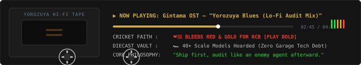
  </a>
   
  <em>(▶ <strong>Click the Cassette above to launch the live synthesized Noir Radio audio player</strong> — runs natively in browser)</em>

## 🏆 FORENSIC RECORD — COMMENDATIONS & CASE VICTORIES

<!-- Animated Trophy Cabinet & Commendations Showcase -->

  

## 📋 THE CASE BOARD — ACTIVE INVESTIGATIONS

<!-- Master Case Board -->

  

## 📡 FILE 01 — MeshWhisper
**STATUS: ACTIVE INVESTIGATION** — Zero-signal, zero-tower encrypted mesh communication

An Android BLE mesh platform engineered for total infrastructure blackouts. Relays forward end-to-end encrypted packet envelopes without possessing the private keys to read them.

<!-- Animated BLE Mesh Routing Diagram -->

  

 

<!-- Animated 32-Bit Protocol Frame & Threat Defense Matrix -->

  

 

  

## 🗑️ FILE 02 — InfraWatch Nexus
**STATUS: AWARDED** — Best Paper Award, ICAHTE-2026 (Paper ID: `AHTE_26_R_101`)

An AI-driven civic monitoring platform deployed across **106 real Municipal Corporation of Delhi (MCD)** sanitation collection stations. Combines physical QR-coded bins as Civic Reference Nodes with real-time AI multimodal scoring.

<!-- Animated Radar Scanner Widget -->

  

 

<!-- Animated Civic AI Pipeline Architecture -->

  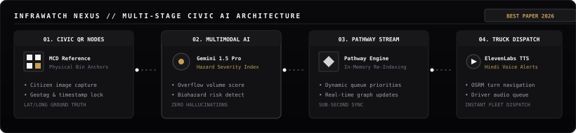

 

  

## 🎓 FILE 03 — AI Teacher (Bharat Academix)
**STATUS: SUBMITTED** — Round 2 Finalist, AI Innovation Hackathon 2026

An autonomous pedagogical system that scripts, visualizes, narrates, and encodes complete, downloadable 720p educational videos with an on-screen synchronized SVG avatar and dynamic audio synthesis.

<!-- Animated AI Video Synthesis Pipeline SVG -->

  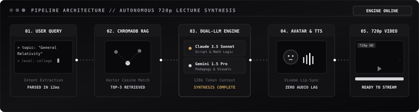

 

  

## 🗃️ RAPID CASE FILES — 04, 05, 06

<!-- Animated Triad Holographic Cards for Kisan-AI, BharatKart, ROADSoS -->

  

 

  
  
  
  

## 🔐 FILE 07 — EVIDENCE LOCKER (Forensic CTFs & Hardware)

<!-- Retro CRT Terminal Preview Banner for Interactive Game -->

  <a href="https://gintama1018.github.io/case-terminal-game.html">
    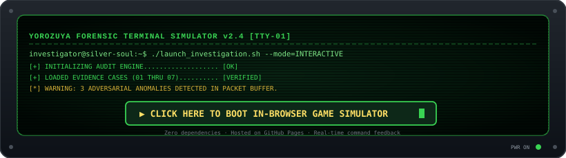
  </a>
   
  <em>(Click the console above to boot our zero-dependency detective terminal simulation hosted on GitHub Pages)</em>

 

<!-- Animated Forensic Evidence Lockers with 8x8 LED Face -->

  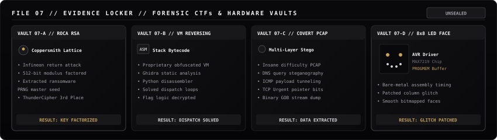

## 🧰 FILE 08 — ISSUED FIELD ARSENAL

<!-- Tactical Skill Icons -->

  

 

<!-- Animated Cyber Field Arsenal Rack with Aesthetic Readiness Meters -->

  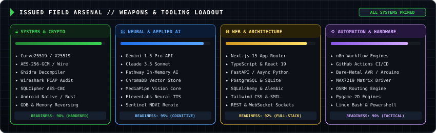

## ⚔️ TACTICAL COMMIT GRID — THE 2D COVER SHOOTOUT

GitHub won't let you run binaries in a README — so we transformed the contribution grid into an active 2D tactical combat zone. Two operatives locked in an exchange of fire, using monochromatic commit stacks as bulletproof cover:

<!-- 2D Animated Contribution Shootout SVG -->

  
   
  <em>(🔊 <strong>Click the Commit Grid above to play live tactical shootout gunfire &amp; ricochet sound effects</strong>)</em>

## 📡 LIVE SURVEILLANCE WIRE — INTERCEPTED DISPATCHES

<!-- SURVEILLANCE_WIRE_START -->
<!-- Animated Live Surveillance Wire SVG -->

  

<!-- SURVEILLANCE_WIRE_END -->

## 📡 SURVEILLANCE TELEMETRY & LIVE METRICS

## 🔒 CLASSIFIED INCIDENT AUTOPSIES

<!-- Animated Redacted Incident Autopsy & Health Diagnostic Console -->

  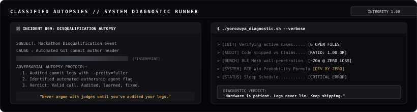

## 📮 DISPATCH CHANNELS — CONTACT THE AGENCY

<!-- Animated Radio Transceiver Comms Deck -->

  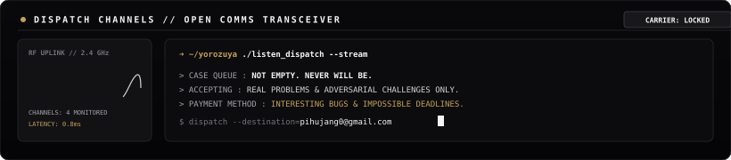

 

  
  
  
  

<!-- Dynamic Cyber Wave Footer -->

