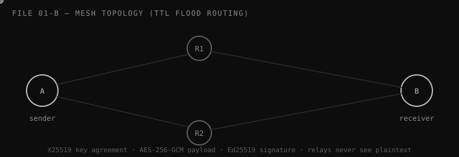

<!--
  ═════════════════════════════════════════════════════════════════════════════
  SILVER SOUL STUDIOS :: CASE DOSSIER ARCHIVE #01018
  CLASSIFIED LEVEL 4 // FOR INVESTIGATIVE PERSONNEL ONLY
  ═════════════════════════════════════════════════════════════════════════════
  DESIGN SYSTEM TOKENS:
    Palette   : Bg #0d0d0d | Panel #141414 | Border #2b2b2b | Silver #C0C0C0 | Gold #D4AF37
    Type      : JetBrains Mono (monospaced telemetry)
    Archetype : Noir Detective / Yorozuya (万事屋 — "The shop that solves everything")
    Status    : 🟢 active | 🟡 submitted | 🏆 awarded | 🔵 live | ⚪ cold case | 🔴 closed
  ═════════════════════════════════════════════════════════════════════════════
-->

<div align="center">



<br/><br/>


<p align="center">
  <code>[CLASSIFIED // LEVEL 4 CLEARANCE]</code> &nbsp;•&nbsp; 
  <code>[BASE: KALADERA ➔ JAIPUR, IN]</code> &nbsp;•&nbsp; 
  <code>[AGENCY: SILVER SOUL STUDIOS]</code>
</p>

<p align="center">
  <a href="https://gintama.tech"></a>
  <a href="https://github.com/gintama1018"></a>
  <a href="https://linkedin.com/in/sonu-jangir-98968b390"></a>
  
</p>

</div>


## 🪪 FILE 00 — SUBJECT DOSSIER

```
IDENTIFIER       Sonu Jangir  (operates in field as GINTAMA)
AGENCY           Silver Soul Studios (independent, one-person investigative shop)
ACADEMIC RECORD  Final-year BCA, UEM Jaipur — Class of 2027
OPERATIONAL BASE Kaladera ➔ Jaipur, Rajasthan, India
SPECIALIZATIONS  protocol engineering · applied cryptography · BLE mesh routing ·
                 multimodal AI integration · high-throughput streaming · reverse engineering
CORE REPUTATION  ships working prototypes first, then audits them like an adversary.
                 most entries below started as rough working demos and survived
                 hardened production stress-testing afterward.
```

### 📜 The Yorozuya Doctrine
> *"If the client's problem is real, the stack is negotiable. If the problem is fake, no framework can save it."*

1. **The Law of Contact:** Anyone can make a demo look good on stage. Real software only proves itself when radio towers fail, background services get killed by OS battery managers, or an attacker sends unauthenticated ACK floods.
2. **The Law of Logs:** Most bugs aren't brilliant mathematical conundrums. They are unhandled exceptions, unread logs, and unpinned dependencies waiting in the dark.
3. **The Yorozuya Spirit:** Named after *Gintama's* Yorozuya (万事屋 — "The shop that takes on any odd job"). Because when you care about fixing broken things, you don't hide behind a single job title.

*Off the record:* Bleeds red & gold for RCB, hoards diecast cars like unmerged branches, and quotes Gintama at 2:00 AM while waiting for Wireshark captures to parse.


## 🏆 FORENSIC RECORD — HALL OF COMMENDATIONS

A timeline of key investigations, hackathon wins, and peer-reviewed honors:

| Commendation | Venue / Agency | Case File Code | Impact & Evidence |
|:---|:---|:---|:---|
| 🏆 **Best Paper Award** | ICAHTE-2026 International Conference | `CASE-02: InfraWatch` | Paper ID: `AHTE_26_R_101` — AI monitoring across 106 real MCD Delhi sanitation nodes |
| 🏆 **1st Place / Winner** | HackUEM National Hackathon | `CASE-05: BharatKart` | Voice-first marketplace engine translating dialect audio for non-typing artisans |
| 🎖️ **AIR 15 of ~30,000** | Google PromptWars Challenge 2 (Hack2Skill) | `CASE-07: CarbonPulse` | High-precision prompt engineering & algorithmic carbon telemetry architecture |
| 🥉 **3rd Place (Podium)** | ThunderCipher National CTF | `LOCKER-07A: ROCA` | Mathematical cryptanalysis: factorized ROCA-vulnerable RSA key & extracted PRNG seed |
| 🟡 **Round 2 Qualifier** | AI Innovation Hackathon 2026 | `CASE-03: Bharat Academix`| Autonomous educational synthesis pipeline generating end-to-end 720p video lessons |


## 📋 CASE BOARD — ACTIVE INVESTIGATION INDEX

| # | Code Name | Status | Domain | Investigation Brief |
|:---:|:---|:---:|:---|:---|
| **01** | [MeshWhisper](#file-01--meshwhisper) | 🟢 ACTIVE | BLE Mesh / Cryptography | Zero-signal, peer-to-peer encrypted communications grid |
| **02** | [InfraWatch Nexus](#file-02--infrawatch-nexus) | 🏆 AWARDED | Civic AI / Streaming | Real-time multimodal sanitation monitoring for Delhi Municipal Corp |
| **03** | [AI Teacher — Bharat Academix](#file-03--ai-teacher--bharat-academix) | 🟡 SUBMITTED | LLM Routing / Video Synthesizer | Dual-LLM autonomous lesson generation with SVG avatar narration |
| **04** | [KISAN-AI](#file-04--kisan-ai) | 🔵 LIVE | Satellite Remote Sensing | Multispectral NDVI crop telemetry for algorithmic agricultural decisions |
| **05** | [BharatKart](#file-05--bharatkart) | 🏆 AWARDED | Voice AI / E-Commerce | Zero-typing product listing engine for rural craftspeople |
| **06** | [ROADSoS](#file-06--roadsos) | ⚪ BUILT | Offline-First Emergency Grid | Cellular blackout emergency dispatch fallback across 12+ countries |


## 📡 FILE 01 — MeshWhisper
**🟢 STATUS: ACTIVE INVESTIGATION** — open case, currently hardening multi-hop routing topology

Android BLE mesh chat engineered for total infrastructure failure — zero cellular coverage, zero towers, zero internet access. Every peer acts as a store-and-forward relay, propagating encrypted payloads it can never decipher.

<p align="center">
  
</p>

### 🔬 Wire Protocol Packet Specification
Every transmission adheres to a strict binary wire frame to prevent buffer overflows and enforce forward secrecy:

```
  0                   1                   2                   3
  0 1 2 3 4 5 6 7 8 9 0 1 2 3 4 5 6 7 8 9 0 1 2 3 4 5 6 7 8 9 0 1
 +-+-+-+-+-+-+-+-+-+-+-+-+-+-+-+-+-+-+-+-+-+-+-+-+-+-+-+-+-+-+-+-+
 |  TTL (1 Byte) | MSG_TYPE (1B) |     PACKET_SEQUENCE (2 Bytes) |
 +-+-+-+-+-+-+-+-+-+-+-+-+-+-+-+-+-+-+-+-+-+-+-+-+-+-+-+-+-+-+-+-+
 |               SENDER_EPHEMERAL_PUBKEY (X25519 - 32 Bytes)     |
 +-+-+-+-+-+-+-+-+-+-+-+-+-+-+-+-+-+-+-+-+-+-+-+-+-+-+-+-+-+-+-+-+
 |                     AES-256-GCM NONCE (12 Bytes)              |
 +-+-+-+-+-+-+-+-+-+-+-+-+-+-+-+-+-+-+-+-+-+-+-+-+-+-+-+-+-+-+-+-+
 |                ENCRYPTED PAYLOAD (Variable Length)            |
 +-+-+-+-+-+-+-+-+-+-+-+-+-+-+-+-+-+-+-+-+-+-+-+-+-+-+-+-+-+-+-+-+
 |                    GCM AUTHENTICATION TAG (16 Bytes)          |
 +-+-+-+-+-+-+-+-+-+-+-+-+-+-+-+-+-+-+-+-+-+-+-+-+-+-+-+-+-+-+-+-+
 |               ED25519 DIGITAL SIGNATURE (64 Bytes)            |
 +-+-+-+-+-+-+-+-+-+-+-+-+-+-+-+-+-+-+-+-+-+-+-+-+-+-+-+-+-+-+-+-+
```

### 🛡️ Threat Model & Adversarial Countermeasures
- **Eavesdropping on Relays:** Solved via Ephemeral Curve25519 Diffie-Hellman (`X25519`). Relay nodes forward unpadded raw byte buffers without possessing private keys.
- **Replay & Broadcast Storms:** Solved via monotonic sliding-window sequence timestamps and TTL decrements (max 7 hops). Duplicate packet IDs are discarded in $O(1)$ memory.
- **Physical Device Seizure:** Solved via `SQLCipher` (AES-256-CBC) database encryption at rest. In-memory master keys zeroized upon abnormal shutdown or panic wipe.
- **Intermittent Bleed & Packet Loss:** Sliding-window chunked transport protocol with SHA-256 block hash validation and selective ACK/NACK retransmissions.
- **Field Test Benchmark:** Verified solid packet transmission through concrete structural walls at ~20m distance with near-instantaneous receipt.

```
CURRENT CASE NOTES (On the desk right now):
[ ] ProGuard / R8 minification optimization pass
[ ] SQLCipher key rotation on emergency wipe
[ ] Multi-hop dynamic mesh topology stress-testing
```

[Examine MeshWhisper Repository →](https://github.com/gintama1018/BIT-FOR-US)

<br/>


## 🗑️ FILE 02 — InfraWatch Nexus
**🏆 STATUS: AWARDED** — Best Paper Award, ICAHTE-2026 (Paper ID: `AHTE_26_R_101`)

An enterprise-grade civic monitoring platform deployed across **106 real Municipal Corporation of Delhi (MCD)** sanitation collection stations. Combines physical QR-coded bins as Civic Reference Nodes with real-time AI multimodal scoring.

```
       [106 MCD Collection Bins]
                 │ (QR-Coded Civic Reference Nodes)
                 ▼
       [Citizen & Sensor Reports]
                 │ (Image + Metadata Telemetry)
                 ▼
       [Gemini 1.5 Multi-Modal Engine] ──▶ Dynamic overflow severity & hazard scoring
                 │
                 ▼
       [Pathway Streaming Engine] ───────▶ High-throughput priority queuing in memory
                 │
                 ▼
       [OSRM + Leaflet Dynamic Router] ──▶ Route optimization for sanitation fleet
                 │
                 ▼
       [ElevenLabs Hindi TTS Alerts] ────▶ Audio dispatches sent directly to drivers
```

- **Forensic Evidence:** Best Paper award citation on record. Actively moving past academic validation toward long-running production fault-tolerance.

[Examine InfraWatch Nexus Repository →][INFRAWATCH_REPO]

<br/>


## 🎓 FILE 03 — AI Teacher (Bharat Academix)
**🟡 STATUS: SUBMITTED** — Round 2 Finalist, AI Innovation Hackathon 2026

An autonomous AI pedagogical system that doesn't just answer questions — it scripts, architectures, visualizes, and narrates full-fledged lessons end to end.

```
[Student Topic Query] ➔ [ChromaDB Vector Retrieval] ➔ [Dual-LLM Router (Claude + Gemini)]
                                                              │
                                                              ▼
[FFmpeg 720p Video Pipeline] ◀── [Dynamic Audio TTS] ◀── [Animated SVG Avatar Engine]
```

- **Dual-Model Arbitrator:** Routes heavy conceptual breakdown through Claude (reasoning & pedagogical structure) and high-speed translation through Gemini.
- **Synthesized Output:** Generates downloadable 720p video lessons with an on-screen synchronized SVG avatar narrator.

[Examine Bharat Academix Repository →](https://github.com/gintama1018/ML-HACKATHON-2-LEVEL-ASSIGNMENT)

<br/>


## 🌾 FILE 04 — KISAN-AI
**🔵 STATUS: LIVE IN PRODUCTION**

Satellite-driven precision agricultural intelligence. Calculates multispectral Normalized Difference Vegetation Index (NDVI) and soil telemetry from orbit to eliminate guesswork in seasonal crop yields.

[Open Live Web Demo →](https://kisan-ai-b2lz.onrender.com) &nbsp;•&nbsp; [Examine KISAN-AI Repository →][KISANAI_REPO]

<br/>


## 🛍️ FILE 05 — BharatKart
**🏆 STATUS: AWARDED** — HackUEM Winner

Autonomous voice-first marketplace designed for rural Indian artisans. Converts unscripted spoken dialect audio into structured e-commerce catalog listings with auto-categorization and pricing intelligence.

[Examine BharatKart Repository →][BHARATKART_REPO]

<br/>


## 🆘 FILE 06 — ROADSoS
**⚪ STATUS: BUILT & ARCHIVED**

Offline-first emergency dispatch web platform architected to function during full communication network failure across 12+ international jurisdictions with zero cloud dependencies.

[Examine ROADSoS Repository →][ROADSOS_REPO]

<br/>


## 🗄️ COLD CASES — ARCHIVED FIELD INVESTIGATIONS

<details>
<summary><b>📂 CLICK TO UNSEAL COLD CASE DOSSIERS (9 ARCHIVED INVESTIGATIONS)</b></summary>
<br/>

| Case Codename | Domain / Type | Investigation Outcome & Metrics |
|:---|:---|:---|
| **CarbonPulse** | Climate AI | Google PromptWars Challenge 2 — Ranked **AIR 15 out of ~30,000** contestants nationwide |
| **ThunderCipher CTF** | Cryptanalysis | **3rd Place Winner** — cracked ROCA RSA weak-key factorization & recovered ransomware seed |
| **Fugacity 2026** | ML / Physics | Physics-informed stacking ensemble for chemical reactor yield modeling (~RMSE 17.93) |
| **The Coiled Snake: A Debt in Blood** | Canvas Engine | Custom 2D arcade combat engine built with vanilla HTML5 Canvas & Web Audio API |
| **Elementia** | Computer Vision | Hand-gesture elemental combat game powered by Python, Pygame, and MediaPipe tracking |
| **Reality Cursor** | Spatial Computing | Real-time computer vision mouse cursor navigation using ArUco marker geometry & MediaPipe |
| **AV Events** | Production Web | 6-page production web portal, Lighthouse score 90+, reduced page-load latency by 35% |
| **DFAP** | Threat Intelligence | Blueprint architecture for government-grade Digital Footprint Analytics Platform |
| **"The Modern Rat Riddler Theory"** | Behavioral Economics | Academic paper on behavioral microeconomics — [DOI: 10.5281/zenodo.20966562](https://doi.org/10.5281/zenodo.20966562) |

</details>

<br/>


## 🔐 FILE 07 — EVIDENCE LOCKER (Forensics & Deep Curiosities)

Real investigations undertaken out of curiosity, security auditing, and the thrill of breaking things:

```
[LOCKER 07-A]  ROCA RSA CRYPTANALYSIS — ThunderCipher CTF (3rd Place)
               TARGET  : ROCA-vulnerable RSA key (Infineon Return of Coppersmith's Attack).
               APPROACH: Formulated algebraic lattice reduction using Coppersmith's theorem.
                         Exploited structure p = k*M + (65537^a mod M) to factorize 512-bit modulus
                         in minutes and extract the ransomware PRNG seed.

[LOCKER 07-B]  CUSTOM VM BYTECODE REVERSAL
               TARGET  : Proprietary bytecode virtual machine with obfuscated opcodes.
               APPROACH: Ghidra static decompilation + custom Python disassembler.
                         Reverse-engineered custom stack machine dispatch loop and executed
                         per-byte constraint solving to recover the verification algorithm.

[LOCKER 07-C]  MULTI-LAYER COVERT-CHANNEL FORENSICS
               TARGET  : "Insane" difficulty CTF network PCAP file.
               APPROACH: Extracted nested steganographic channels across DNS queries, ICMP ping
                         payloads, TCP Urgent pointers, and binary GOB stream deserialization.

[LOCKER 07-D]  8x8 LED MATRIX ANIMATION ENGINE — Arduino Bare-Metal
               TARGET  : Hardware facial animation rig on MAX7219 driver.
               APPROACH: Bitmapped frame buffers in AVR PROGMEM. Solved a hardware column-transpose
                         rendering bug in assembly-level clock timings.
```

### 🎮 Live Simulation: The Case Terminal
Want to see how an audit unfolds under pressure? Run our interactive in-browser investigation simulator:

<p align="center">
  <a href="https://gintama1018.github.io/case-terminal-game.html">
    
  </a>
</p>
<p align="center">
  <em>(A standalone, zero-dependency terminal simulation hosted via GitHub Pages — runs entirely in your browser)</em>
</p>


## 🧰 FILE 08 — ISSUED FIELD ARSENAL

A classified breakdown of tools, runtimes, and engineering primitives deployed across cases:

<table>
<tr>
<td width="50%" valign="top">

### 🔒 Systems & Security Engineering
- **Cryptography:** X25519 ECDH · Ed25519 · AES-256-GCM · SQLCipher
- **Forensics & Audit:** Wireshark · GDB · Ghidra · ROCA Factorization
- **Mobile & Low-Level:** Android Native (Kotlin/Java) · BLE Mesh Topology · Rust (MeshNet)

</td>
<td width="50%" valign="top">

### 🧠 Multimodal AI & High-Throughput Data
- **Neural Models:** Gemini 1.5 Multi-Modal API · Claude 3.5 Sonnet API
- **Streaming & Memory:** Pathway Streaming Engine · ChromaDB Vector Store
- **Vision & Audio:** MediaPipe · OpenCV · ArUco Tracking · ElevenLabs TTS · FFmpeg

</td>
</tr>
<tr>
<td width="50%" valign="top">

### 🌐 Web & Runtime Architecture
- **Backend:** FastAPI · Python 3.12+ · SQLAlchemy · Node.js
- **Frontend:** Next.js (App Router) · TypeScript · HTML5 Canvas · Tailwind CSS
- **Databases:** SQLite (Raw & Encrypted) · PostgreSQL

</td>
<td width="50%" valign="top">

### ⚙️ Automation & Tooling
- **Orchestration:** n8n Workflow Automation · GitHub Actions CI/CD
- **Spatial / Routing:** OSRM Routing Engine · Leaflet.js Geocoding
- **Graphics & Sidearms:** Pygame · Bare-Metal Arduino (MAX7219)

</td>
</tr>
</table>

<p align="center">
  
</p>


## ⏳ CASE LOAD TELEMETRY (Current Attention Allocation)

Not an arbitrary KPI. An honest representation of where CPU and mental cycles are allocated:

```
MeshWhisper Hardening & BLE Multi-hop     ████████████████░░░░  [78% — In Deep Testing]
InfraWatch Nexus Productionization        ██████████░░░░░░░░░░  [52% — Scaling Pipeline]
Reverse Engineering & CTF Forensics       ████████░░░░░░░░░░░░  [40% — Periodic Recon]
Sleep Schedule & Sanity                   ██░░░░░░░░░░░░░░░░░░  [10% — Critical Low]
```


## 📡 SURVEILLANCE LOG & METRICS

<div align="center">


</div>

<br/>

### ⚔️ TACTICAL COMMIT GRID — THE GREEN COVER SHOOTOUT
GitHub won't let you run arbitrary game binaries in a README — so we turned the contribution grid into a 2D combat zone. Two operatives locked in an exchange of fire, using green commit clusters as tactical bulletproof cover:

<div align="center">
  
</div>

<br/>


## 🔒 CLASSIFIED INCIDENT LOGS

<details>
<summary><b>📁 [REDACTED] CASE 099 — THE DISQUALIFICATION AUTOPSY (Click to read log)</b></summary>
<br/>

```
INCIDENT REPORT #099:
Subject entered a hackathon. Disqualified for an automated Git commit author flag.
Adversarial autopsy conducted:
  1. Checked git log --pretty=fuller.
  2. Identified an AI agent's authorship fingerprint sitting in the commit header.
  3. Verdict: Valid disqualification. 
  4. Core Lesson: "Never argue with the judges until you've audited your own commit log."
```

</details>

<details>
<summary><b>⌨️ RUN DIAGNOSTIC SCAN (Execute local agent health check)</b></summary>
<br/>

```bash
$ ./yorozuya_diagnostic.sh --verbose

> [INIT] Verifying active cases............... [6 OPEN FILES]
> [AUDIT] Code shipped vs Claims made......... [RATIO: 1.00 - VERIFIED]
> [BENCHMARK] BLE Mesh wall-penetration....... [~20m @ ZERO PACKET LOSS]
> [SYSTEM] RCB Win Probability Formula........ [ERROR: DIVISION_BY_ZERO]
> [STATUS] Sleep Schedule..................... [CRITICAL ERROR - CASE SUSPENDED]

DIAGNOSTIC VERDICT:
  "Hardware is patient. Logs never lie. Keep shipping."
```

</details>


## 📮 DISPATCH CHANNELS — CONTACT THE AGENCY

Have an intriguing problem? A broken protocol? Or an adversarial audit you need run?

<p align="center">
  <a href="https://gintama.tech"></a>
  <a href="https://github.com/gintama1018"></a>
  <a href="mailto:pihujang0@gmail.com"></a>
  <a href="https://linkedin.com/in/sonu-jangir-98968b390"></a>
</p>

<div align="center">

```
$ ./yorozuya --listen

> CASE QUEUE     : NOT EMPTY. NEVER WILL BE.
> ACCEPTING      : REAL PROBLEMS & ADVERSARIAL CHALLENGES ONLY.
> PAYMENT METHOD : INTERESTING BUGS & IMPOSSIBLE DEADLINES.

$ _
```

</div>

[INFRAWATCH_REPO]: https://github.com/gintama1018/HACK-FOR-GREEN-BHARAT-HACKATHON
[BHARATKART_REPO]: https://github.com/gintama1018/BHARAT-KART---AUTONOMOUS-HACKS-FINALE-PROJECT
[ROADSOS_REPO]: https://github.com/gintama1018/ROAD-SAFETY-PROJECT
[KISANAI_REPO]: https://github.com/gintama1018/KISAN-AI
